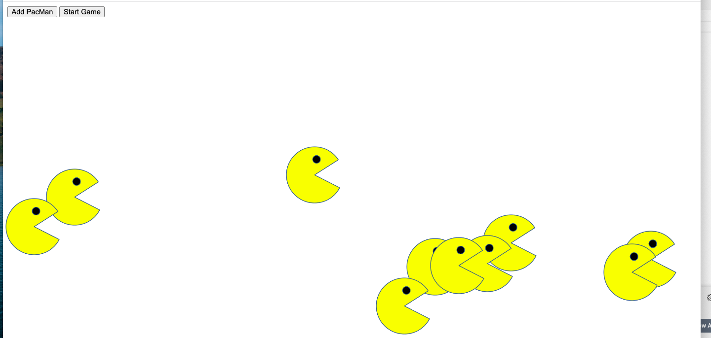

# Pacmen
## Description
Creates pacmen on a screen 
There are 2 buttons; one that adds pacmen and one that starts the game.
The pacmen move at random velocities and bounce off of the sides of the screen. 

## Roadmap of future improvements:
I would like to have the pacmen face they direction the are going.
A stop and reset button would be nice as well

## To run the program
In the upper portion of this screen there is a green button labeled code.
Click on that button.
A dropdown box will appear.
Download the zip file.
Open the zip file.
Drag and drop the html file onto a browser page

 

